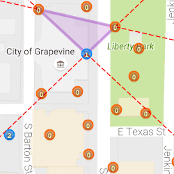

# IITCPlugins

### Extend Polygon Lines

Extends the edges of each polygon drawn past each vertex. This is useful for determining which portals to include in a layered field.

Enable the 'Extend Polygon Lines' layer to see the extended lines.
