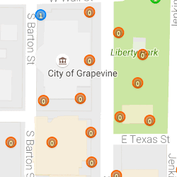
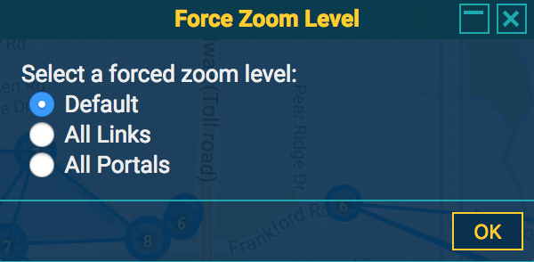

# TheSned's IITC Plugins

### Extend Polygon Lines

 

Direct Link: [Click Here](https://raw.githubusercontent.com/TheSned/IITCPlugins/master/extend-poly-lines.user.js)

Extends the edges of each polygon or polyline drawn past each vertex. This is useful for determining which portals to include in a layered field.

Enable the 'Extend Polygon Lines' or 'Extend Polyline Lines' layer to see the extended lines.

### Force Zoom Level

Forces the display of All Portals or All Links regardless of zoom level. Select the forced zoom level you want in the "Force Zoom Opt" dialog. Warning: This can cause many requests to the server at high zoom levels.